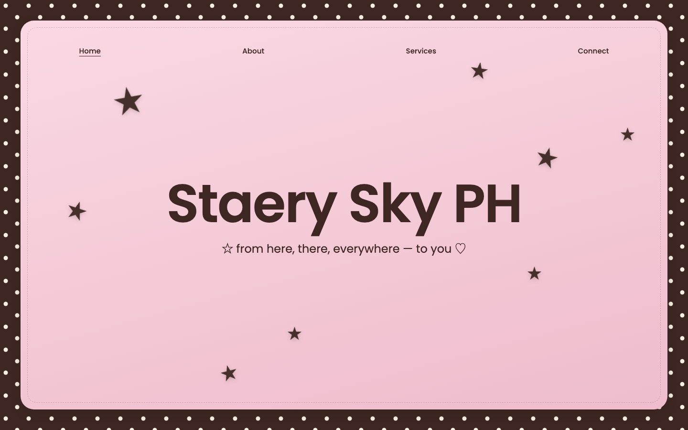
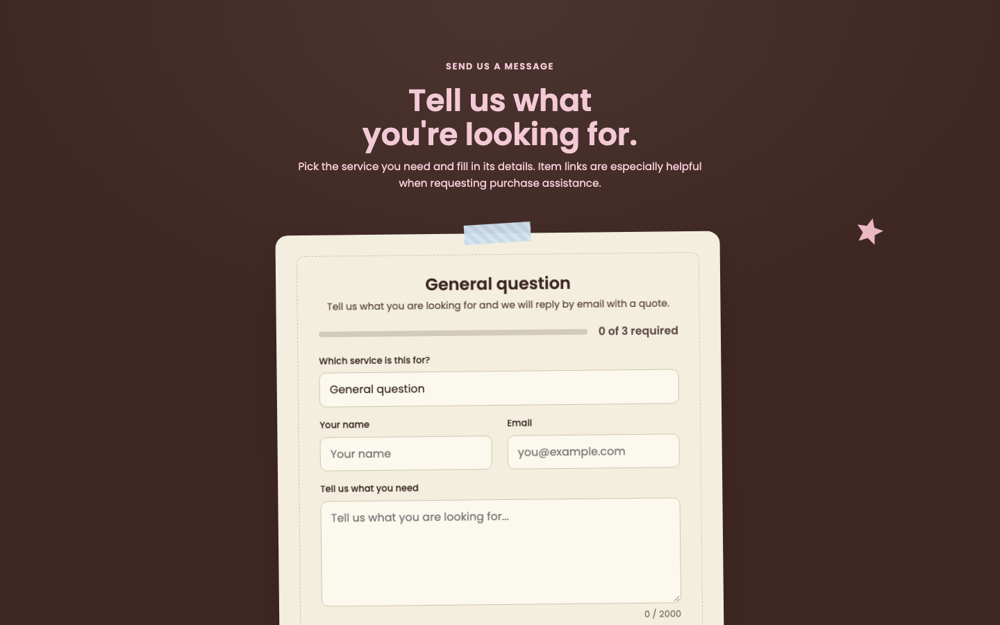

# Staery Sky PH

[](AI-USAGE.md)

## My project repository

Public repository: https://github.com/juliankaiaaa/juliankaiaaa-staeryskyph

Live app: https://juliankaiaaa.github.io/juliankaiaaa-staeryskyph/

## What it is

Staery Sky PH is the portfolio website for a fan-owned shop offering Japan,
Korea, and Thailand purchase assistance, shipping, and package
consolidation. Visitors browse the services and send a request; the shop
owner reviews requests from a private admin page.

## What it looks like

The site uses a scrapbook-style look: paper textures, washi tape, and
hand-drawn stars over a brown-and-pink palette.



Services, laid out as cards with a photo, a short description, and a tag
color per service:


The request form, where a visitor picks a service and sends their request:



## How to run it

```bash
git clone https://github.com/juliankaiaaa/juliankaiaaa-staeryskyph.git
cd juliankaiaaa-staeryskyph/client
npm install
npm run dev
```

Open `http://localhost:5173/`. No setup is needed to try the site — it
runs in demo mode by default, with sample data and no database connection.

To run it against a real backend instead of demo mode, create a Supabase
project, run `supabase/schema.sql` then `supabase/seed.sql` in its SQL
editor, and add these to `client/.env` (example values, not real ones):

```
VITE_USE_MOCK_API=false
VITE_SUPABASE_URL=https://your-project.supabase.co
VITE_SUPABASE_ANON_KEY=your-anon-key
```

## Presentation

- Video (public Google Drive link): not yet added
- Slides (link or PDF): not yet added
- Square image: not yet added

## AI usage

Link to the `AI-USAGE.md` in my project repository:
https://github.com/juliankaiaaa/juliankaiaaa-staeryskyph/blob/main/AI-USAGE.md
