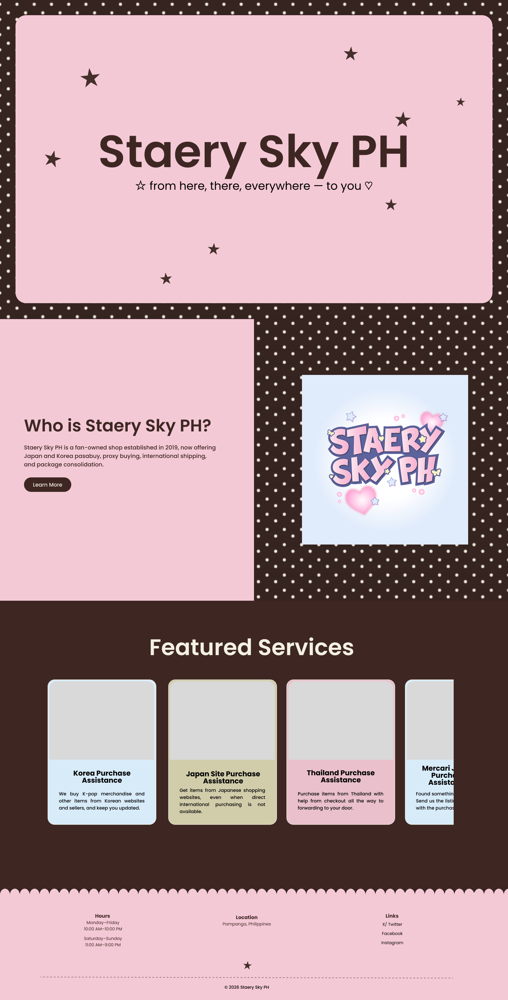
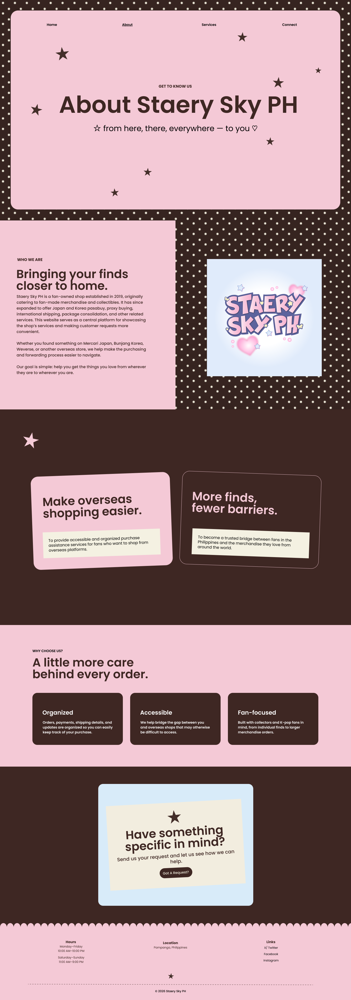
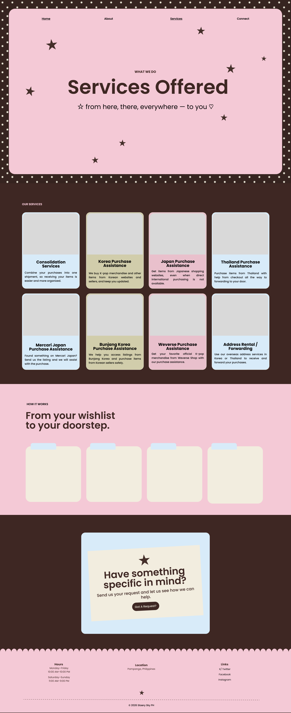
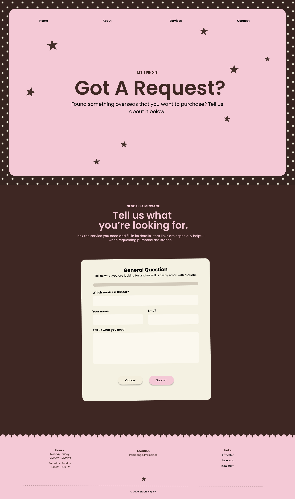

# Mockup

Full-page mockups of Home, About, Services, and Contact (request), desktop
width. Images in [mockup/](mockup/).

## Home

## About

## Services

## Contact (request)

## Notes

- Logo square is plain in the mockup; built version has the scalloped
  frame + polaroid border
- Service card photos are grey placeholders in the mockup; built cards
  have real photos (flags, Mercari/Bunjang/Weverse logos) + washi tape
- How it works steps are empty in the mockup; built cards have the
  number badge, heading, and text filled in
- Request CTA is a flat card in the mockup; built version is the
  animated envelope/letter
- Mission, vision, and why-choose-us cards: built ones have washi tape
  corners + number badges, mockup doesn't
- Request form: mockup just has Submit; built form has the tilt, tape,
  "Send inquiry", required counter, char counter, and the two links
  after sending
- Mockup reuses the home tagline on every page; built pages each have
  their own intro line
